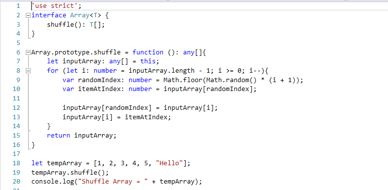

# TypeScript + Shuffling Array

Code to add a shuffle() method to Array.

Sample code is located in `scripts\shuffle.ts`

Inspired by **@Kirupa's** article "Shuffling an Array in JavaScript".
http://www.kirupa.com/html5/shuffling_array_js.htm 